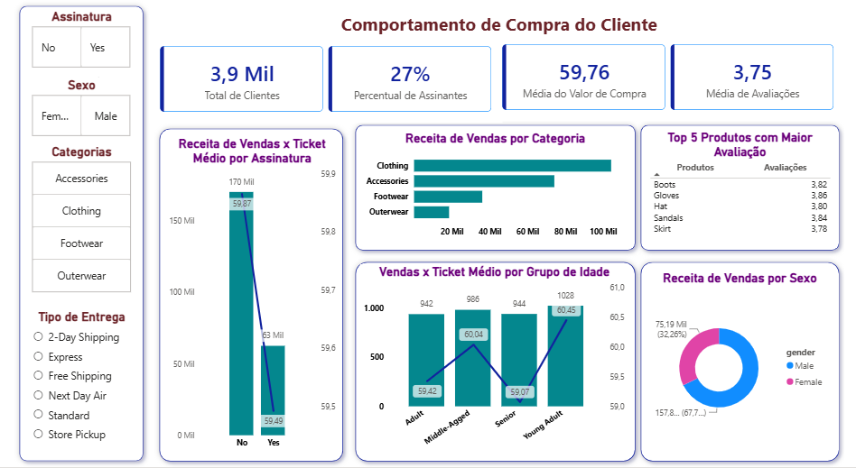

# Consumer Shopping Behavior

Análise do comportamento de compra de 3.900 clientes de um varejo. Elaborado com o intuito de praticar de ponta a ponta uma pipeline de Análise de Dados: desde a limpeza de dados, análise exploratória de dados, armazenamento e consultas, e visualização dos insights. Esse projeto foi construído com Pandas, SQL e Power BI.

> Repositório de Referência: [Amlan Mohanty](https://github.com/amlanmohanty1/customer-trends-data-analysis-SQL-Python-PowerBI/blob/main/Customer_Shopping_Behavior_Analysis.ipynb)
  
   



## Índice
- [Problema de Negócio](#problema-de-negócio)
- [Objetivo da Análise](#objetivo-da-análise)
- [Arquitetura do Projeto](#arquitetura-do-projeto)
- [Etapas da Análise](#etapas-da-análise)
- [Principais Decisões de Limpeza](#principais-decisões-de-limpeza)
- [Perguntas de Negócio](#perguntas-de-negócio)
- [Entregáveis](#entregáveis)
- [Como Executar](#como-executar)
- [Próximos Passos](#próximos-passos)
- [Autor](#autor)

##  Problema de Negócio

Uma empresa de varejo quer entender melhor o comportamento de compra dos seus clientes para melhorar vendas, satisfação e fidelização a longo prazo. A gestão percebeu variações nos padrões de compra entre diferentes perfis de cliente e categorias de produto, e precisa identificar quais fatores realmente influenciam a receita e a recorrência de compra.

##  Objetivo da Análise

Responder a essa pergunta de forma estruturada, traduzindo-a em dez perguntas de negócio específicas e mensuráveis, através de um pipeline reprodutível:

1. Preparar e tratar os dados brutos em Python, documentando cada decisão de limpeza;

2. Modelar e consultar os dados via SQL, respondendo cada pergunta de negócio individualmente;

3. Visualizar os padrões encontrados num dashboard interativo em Power BI;

4. Comunicar os achados através de um relatório e uma apresentação voltados a um público não técnico.

## Arquitetura do Projeto 

O projeto segue um pipeline linear, onde cada etapa consome a saída da anterior: os dados brutos são tratados com Pandas, carregados no PostgreSQL, e a partir do banco se ramificam em duas frentes de consumo - as consultas SQL, que respondem às perguntas de negócio, e o Power BI, que consolida os resultados num dashboard interativo.


## Etapas da Análise:

1.  **Limpeza de Dados:** tratamento de valores ausentes, padronização de colunas e criação de variáveis derivadas.
2.  **Conexão ao PostgreSQL:** carga do dataset tratado numa tabela `customer`, via SQLAlchemy.
3.  **Análise com SQL:** dez consultas independentes, cada uma respondendo a uma pergunta de negócio específica.
4.  **Visualização no Power BI:** dashboard interativo com slicers de categoria, gênero, assinatura e tipo de envio.

## Principais Decisões de Limpeza

-   **Valores ausentes em `review_rating`:** imputados pela mediana de cada categoria, evitando interferência da mediana global.
-   **`age_group`:** para que os grupos reflitam a distribuição real da base em vez de intervalos arbitrários.
-   **`purchase_frequency_days`:** conversão dos rótulos textuais de frequência de compra em número de dias, viabilizando análises quantitativas.
-   **`discount_applied` x `promo_code_used`:** verificada equivalência total entre as colunas antes de remover a redundante.

## Perguntas de Negócio
> Todas as consultas utilizadas para responder as Perguntas de Negócio estão na pasta `queries/` com suas respectivas tabelas resultantes.

1. **Qual é a receita total gerada por clientes do sexo masculino x feminino?**
O público masculino gera uma receita total de $157.890, enquanto o público feminino gera $75.191. Isso reflete que 68% dos clientes são homens.

2. **Quais clientes utilizaram desconto, mas ainda assim gastaram acima do valor médio de compra?**
839 clientes se enquadram nesse critério, mais de um quinto do total de clientes (3.900). Gasto médio entre eles é de $79,79.

3. **Quais são os 5 produtos com a maior média de avaliação?**
Gloves (3,86), Sandals (3,84), Boots (3,82), Hat (3,80), Skirt (3,78).

4. **Compare os valores médios de compra entre as modalidades de envio Padrão e Expresso.**
O envio Expresso tem uma média de compra de $60,48, já o envio Padrão apresenta uma média de $58,46. 

5. **Clientes assinantes gastam mais? Compare o gasto médio e a receita total entre assinantes e não assinantes.**
Não assinantes tem um total de 2.847 clientes, com $59,87 de ticket médio e $170.436 de receita, já os Assinantes tem um total de 1.053 clientes, com $59,49 de ticket médio e $62.645 de receita. Assim, a assinatura não está associada a um gasto maior.

6. **Quais são os 5 produtos com a maior porcentagem de compras com desconto aplicado?**
Hat (50%), Sneakers (49%), Coat (49%), Sweater (48%), Pants (47%). Quase metade das vendas desses itens depende de desconto.

7. **Segmente os clientes em Novos, Recorrentes e Fiéis com base no número de compras anteriores.**
Fiéis: 3.116 (79,9%), Recorrentes: 701 (18,0%) e Novos: 83 (2,1%). Base fortemente consolidada, com pouca entrada de clientes novos.

8. **Quais são os 3 produtos mais comprados em cada categoria?**
Acessories: Jewelry (171), Sunglasses (161) e Belt (161);
Clothing: Blouse (171), Pants (171) e Shirt (169); 
Footwear: Sandals (160), Shoes (150) e Sneakers (145);  
Outerwear: Jacket (163) e Coat (161).

9. **Clientes com mais de 5 compras anteriores têm maior probabilidade de assinar o serviço?**
Entre clientes com mais de 5 compras anteriores (3.476 no total): 958 assinantes (27,6%) e 2.518 não assinantes. Essa taxa é praticamente idêntica à taxa de assinatura da base geral (27,0%), ou seja, uma maior frequência de compra não está associada a maior chance de assinatura

10. **Qual é a contribuição de cada faixa etária para a receita?**
Young Adult ($62.143), Middle-Aged ($59.197), Adult ($55.978) e Senior ($55.763)

## Entregáveis

- 📊 [`customer-behavior_dashboard.pbix`](./deliverables/customer-behavior_dashboard.pbix): dashboard interativo no Power BI;
- 🎞️ [`customer-behavior_presentation.pptx`](./deliverables/customer-behavior_presentation.pptx): apresentação com a síntese do projeto;
- 📄 Relatório de análise com achados e recomendações de negócio.

## Como Executar

### 1. Clonar o repositório e instalar as dependências

```bash
git clone https://github.com/rafamarqsdev24/customer-shopping-behavior.git
cd customer-shopping-behavior
pip install -r requirements.txt

```

### 2. Configurar as variáveis de ambiente

Crie um arquivo `.env` na raiz do projeto com as credenciais do seu banco PostgreSQL:

```
DB_USERNAME=seu_usuario
DB_PASSWORD=sua_senha
DB_HOST=localhost
DB_PORT=5432
DB_DATABASE=customer_behavior
```

### 3. Criar o banco de dados

Crie manualmente o banco `customer_behavior` via pgAdmin, com encoding `UTF8`:

1.  Botão direito em **Databases** → **Create** → **Database...**
2.  Nome: `customer_behavior`
3.  Salvar

###  4. Executar os notebooks, em ordem

1. **01_data-cleaning.ipynb:** gera um DataFrame limpo com destino a `data/processed/customer_shopping_behavior_clean.csv`;

2. **02_connection-postgres.ipynb:** carrega os dados tratados na tabela `customer` do banco criado no passo 3.


### 5. Explorar

- As consultas SQL de `queries/` podem ser executadas diretamente sobre a tabela `customer`;
- O dashboard `deliverables/customer-behavior_dashboard.pbix` pode ser aberto no Power BI Desktop e reconectado ao seu banco local;
- A apresentação `deliverables/customer-behavior_presentation.pptx` traz a síntese dos achados.

## Próximos Passos

Este projeto tem um recorte deliberado de Análise de Dados — EDA, SQL e dashboard, sem modelagem preditiva. Planos futuros, à medida que os conceitos de Machine Learning forem consolidados:

- Prever `purchase_amount` ou `review_rating` a partir das demais variáveis;
- Avaliar o modelo com métricas apropriadas e validação cruzada;
- Comparar o resultado contra o baseline estatístico já estabelecido neste projeto.

## Autor

**Rafael Marques**
Estudante de Análise e Desenvolvimento de Sistemas, FAETERJ Paracambi

[](https://www.linkedin.com/in/rafamarques12/) [](https://github.com/rafamarqsdev24) [](mailto:rafaelmarques.dev24@gmail.com)